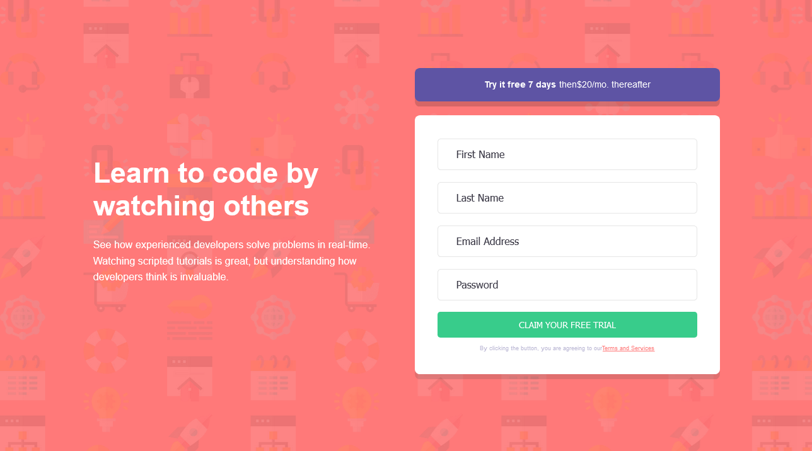
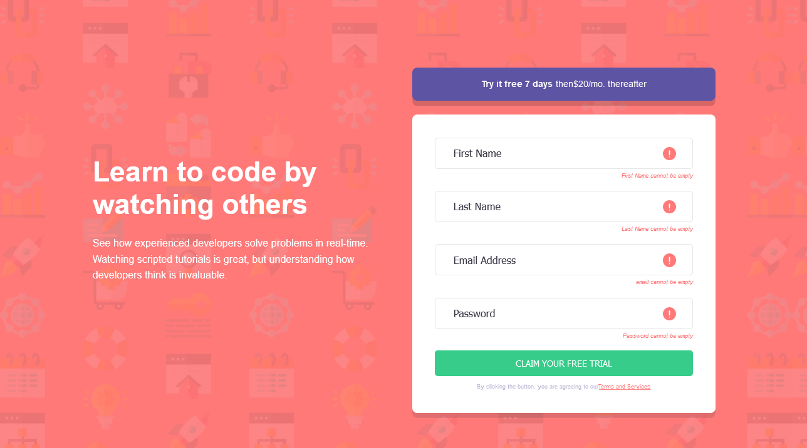
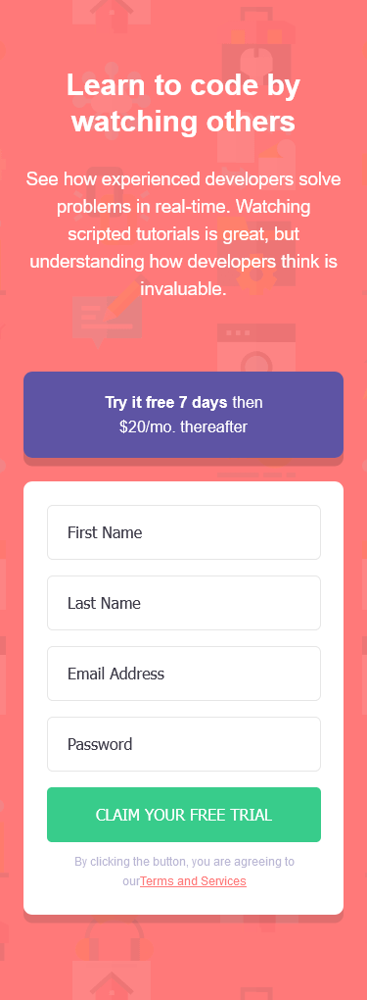
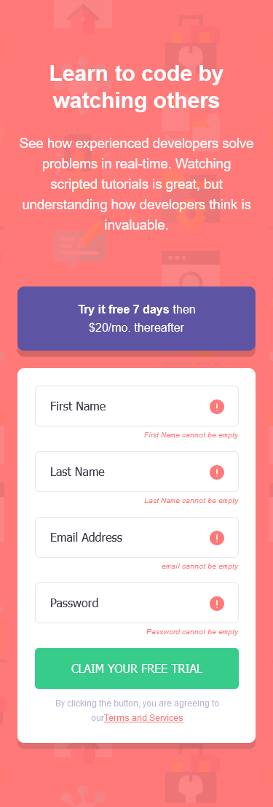

# Frontend Mentor - Intro component with sign up form solution

This is a solution to the [Intro component with sign up form challenge on Frontend Mentor](https://www.frontendmentor.io/challenges/intro-component-with-signup-form-5cf91bd49edda32581d28fd1). Frontend Mentor challenges help you improve your coding skills by building realistic projects.

## Table of contents

-   [Overview](#overview)
    -   [The challenge](#the-challenge)
    -   [Screenshot](#screenshot)
    -   [Links](#links)
-   [My process](#my-process)
    -   [Built with](#built-with)
    -   [What I learned](#what-i-learned)
    -   [Continued development](#continued-development)
    -   [Useful resources](#useful-resources)
-   [Author](#author)
-   [Acknowledgments](#acknowledgments)

**Note: Delete this note and update the table of contents based on what sections you keep.**

## Overview

This is a landing page that provides access to a platform where users can likely watch developers working on their projects and engage in related activities, such as group project creation. Users not only develop software but also collaborate with their teams to implement functionalities. The platform's possibilities could be endless, as suggested by the description. The access landing page is structured with a description on the left and a form for data registration on the right. For a newbie-level project, it is satisfactory.

### The challenge

Users should be able to:

-   View the optimal layout for the site depending on their device's screen size
-   See hover states for all interactive elements on the page
-   Receive an error message when the `form` is submitted if:
    -   Any `input` field is empty. The message for this error should say _"[Field Name] cannot be empty"_
    -   The email address is not formatted correctly (i.e. a correct email address should have this structure: `name@host.tld`). The message for this error should say _"Looks like this is not an email"_

### Screenshot

## My process

I created the projects using Figma designs. I analyzed the project and decided not to use variables because these are simple projects, and I have already grasped the concept of variables. The project is essentially a main container with two boxes inside: one for text and another for inputs. Structurally, nothing major occurred, but while coding the JavaScript, I had to go back and add boxes to the input fields to adjust the icons. This was inconvenient as I had to fix the paths of elements in the CSS. However, it involved only two scopes of code. In a larger project, this would have required more effort. For CSS, elements were specified in a hierarchical order, and in JavaScript, I selected elements by their IDs instead of classes because it makes the code cleaner, even if it becomes more verbose.

### Built with

-   Semantic HTML5 markup
-   CSS custom properties
-   Flexbox
-   CSS Grid

### What I learned

This is my second time creating a form, and this time I selected all elements by their IDs. In my first form, I selected elements by their classes and realized that maintaining the code in the future would be messy. I had used variables with indices to make the code work. This time, I did things differently.

### Continued development

I am excited to work on more sophisticated designs and eventually on 3D pages or enterprise software. However, I think implementing a 3D project in software that runs only within a company might be challenging. While practicing, it is always good to revisit concepts that haven't been practiced for a while. For instance, even if variables are not often used across different pages, I will start using them just for practice. Who knows, I might discover some errors that occur when using this method. Note: I have used variables unnecessarily in some projects. As for new technologies, I plan to learn about some APIs, or maybe just one or two if there is too much content. I understand the concept of APIs, but I am unsure about the extent of their usage. After completing the front end with HTML, CSS, and JavaScript, I intend to move on to the back end.

## Author

-   Frontend Mentor - [@FredericoGarciasAlves](https://www.frontendmentor.io/profile/FredericoGarciasAlves)
-   Instragam - [@fred_alves23](https://www.instagram.com/fred_alves23/)
-   Twitter - [@FredericoGA70](https://x.com/FredericoGA70)
-   Threads - [@fred_alves23](v)
